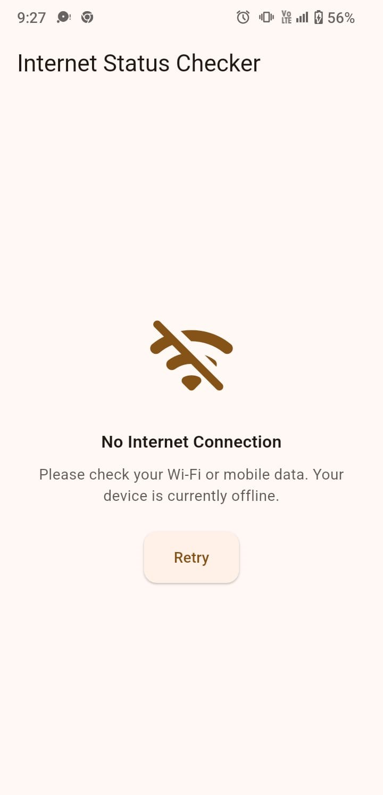

# internet_status_checker

A Flutter plugin to detect **actual validated internet access** on Android, **without making any network/API calls**, and faster than most connectivity solutions that rely on polling or external requests.

---

## Why use this?

Many solutions only detect whether a network is available.  
This plugin checks whether the connection is actually validated by Android using:

- `NET_CAPABILITY_INTERNET`  
- `NET_CAPABILITY_VALIDATED`

It does **not** make any HTTP requests or ping external servers, so it is **much faster** and more efficient than API-based connectivity checks.

This makes it especially useful for:

- Offline screens  
- Splash checks  
- Retry flows  
- API-dependent screens  
- Network-aware UI  

---

## Platform support

| Platform | Supported |
|----------|-----------|
| Android  | ✅        |
| iOS      | ❌        |
| Web      | ❌        |
| macOS    | ❌        |
| Windows  | ❌        |
| Linux    | ❌        |

---

## Installation

Add this to your `pubspec.yaml`:

```yaml
dependencies:
  internet_status_checker: ^0.0.1
```

Then run:

```
flutter pub get
```

---

## How to use

### 1️⃣ Check internet status

```dart
import 'package:internet_status_checker/internet_status_checker.dart';

bool? isConnected;

Future<void> checkConnection() async {
  isConnected = await InternetStatusChecker.isConnected();
  print('Internet status: $isConnected');
}
```

### 2️⃣ Show a simple offline UI

```dart
import 'package:flutter/material.dart';
import 'package:internet_status_checker/internet_status_checker.dart';

class MyHomePage extends StatefulWidget {
  const MyHomePage({super.key});

  @override
  State<MyHomePage> createState() => _MyHomePageState();
}

class _MyHomePageState extends State<MyHomePage> {
  bool? isConnected;

  @override
  void initState() {
    super.initState();
    checkConnection();
  }

  Future<void> checkConnection() async {
    final result = await InternetStatusChecker.isConnected();
    setState(() {
      isConnected = result;
    });
  }

  @override
  Widget build(BuildContext context) {
    return Scaffold(
      body: isConnected == null
          ? const Center(child: CircularProgressIndicator())
          : isConnected!
              ? const Center(child: Text('Connected ✅'))
              : NoInternetView(
                  onRetry: checkConnection,
                ),
    );
  }
}
```

### 3️⃣ Customize `NoInternetView`

```dart
NoInternetView(
  title: 'Offline!',
  message: 'We could not connect to the internet. Please try again.',
  illustration: Image.asset('assets/nointernet.png'), // optional
  retryText: 'Try Again',
  onRetry: checkConnection,
)
```

| Parameter | Description |
|-----------|-------------|
| `title` | Main heading |
| `message` | Description text |
| `illustration` | Optional custom image or animation |
| `retryText` | Button text |
| `onRetry` | Callback when user taps retry |

---

## Screenshots




---

## Notes

- Android only
- Very fast: does not make any API calls or network requests
- Lightweight and efficient
- Ideal for apps that need instant network status checks

---

## License

MIT
